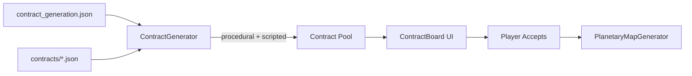

# Data Formats

This document describes every JSON data format used by the game. All data files live under `data/` and are loaded at runtime. Modders can add, override, or extend any data directory by dropping in additional `.json` files — the game merges all files within a directory (arrays concatenate, dictionaries merge by key, last writer wins where conflicts exist).

**Development constraint:** All data formats and their data flows must be documented with Mermaid flow diagrams in markdown files, and covered by both positive and negative unit tests in `tests/test_data_formats.gd` or the relevant subsystem test file. When adding a new data format or modifying an existing one:
1. Update or add a Mermaid graph showing the data flow (where files are loaded, which system consumes them, how they interact)
2. Add positive tests (valid data loads and produces expected results)
3. Add negative tests (missing data, malformed data, edge cases do not crash)

**Existing note:** Any changes to data formats — adding new fields, removing fields, changing semantics, or introducing new data directories — should receive a documentation pass. If you're adding a new data file or modifying an existing format, update this document.

---

## Directory Layout

```
data/
├── components/         # 263 files — BattleTech component definitions
├── config/             # 2 files — game configuration
│   ├── contract_generation.json
│   └── spares_config.json
├── contracts/          # scripted contract chain definitions
├── factions/           # 33 files — faction metadata
├── maps/
│   └── canonical/
│       └── planetary/  # pre-authored planetary hex maps
├── planetary/
│   ├── biomes/         # biome terrain definitions and conditions
│   ├── objectives/     # objective templates and exploration events
│   ├── opfor/          # OpFor templates (ephemeral + canonical)
│   └── regions/        # generic region templates
├── rat/                # 12 files — Random Assignment Tables
├── rules/              # 3 files — game rules configuration
│   ├── cluster_hits.json
│   ├── combat_config.json
│   └── suspension_factors.json
├── systems/            # 3174 files — per-system starmap data
├── unit_types/         # 2 files — unit type definitions
├── skills.json         # 169 data-driven skill definitions
├── systems_index.json  # lightweight starmap index (~190 KB)
└── timeline_events.json # 9718 lore timeline events
```

## Data Flow

```mermaid
flowchart TD
    subgraph Config
        CG[contract_generation.json]
        SC[spares_config.json]
    end
    subgraph "Static Data"
        FA[factions/*.json]
        CO[components/*.json]
        SK[skills.json]
        RA[rat/*.json]
        RU[rules/*.json]
        UT[unit_types/*.json]
        SI[systems_index.json]
        TL[timeline_events.json]
    end
    subgraph "Planetary Generation"
        BI[planetary/biomes/*.json]
        OB[planetary/objectives/*.json]
        OF[planetary/opfor/*.json]
        RE[planetary/regions/*.json]
        CM[maps/canonical/planetary/*.json]
    end
    subgraph "Scripted Content"
        CT[contracts/*.json]
    end

    CG -->|ContractGenerator| Pool[Contract Pool]
    SC -->|InventoryManager| Log[Logistics System]
    FA -->|DataManager| Starmap[StarMap + Faction Data]
    CO -->|DataManager + MegaMekParser| Units[Unit Templates + Component Defs]
    SK -->|DataManager| Pers[Personnel Generation]
    RA -->|RATParser + StrategicUnitGenerator| ForceGen[Force Generation]
    RA -->|RATParser + PlanetaryMapGenerator| OpForGen[OpFor Generation]
    RU -->|CombatResolver| Combat
    SI -->|StarMap| MapDisplay[Starmap Display]
    TL -->|TimeManager| Events[Timeline Events]
    BI -->|PlanetaryMapGenerator| Terrain[Terrain Gen]
    OB -->|PlanetaryMapGenerator| ObjPlace[Objective Placement]
    OF -->|PlanetaryMapGenerator| OpForPool[OpFor Pool]
    RE -->|PlanetaryMapGenerator| RegionGen[Region Selection]
    CM -->|PlanetaryMapGenerator| Canonical[Canonical Map Load]
    CT -->|ContractGenerator| Scripted[Scripted Contracts]
```



## Test Coverage

| Data directory | Loader | Test file | Tests | Positives | Negatives |
|----------------|--------|-----------|-------|-----------|-----------|
| `components/` | MegaMekParser | `test_mtf_validation.gd` | 13 | parse MTF/BLK | (implicit) |
| `config/contract_generation.json` | ContractGenerator | `test_market_population.gd` + `test_data_formats.gd` | 25 | loads, has keys, types valid | missing file, empty dict |
| `config/spares_config.json` | InventoryManager | `test_data_formats.gd` | 2 | loads, has keys | — |
| `contracts/` | ContractGenerator | `test_planetary_map_generator.gd` | 3 | loads, find by id | unknown id |
| `factions/` | DataManager | `test_market_population.gd` (implicit) | — | — | — |
| `planetary/biomes/` | PlanetaryMapGenerator | `test_planetary_map_generator.gd` | 4 | resolution, fallback | missing data |
| `planetary/objectives/` | PlanetaryMapGenerator | `test_planetary_map_generator.gd` | 1 | placement | — |
| `planetary/opfor/` | PlanetaryMapGenerator | `test_planetary_map_generator.gd` | 6 | load, select, generate, draw | no match, empty pool |
| `planetary/regions/` | PlanetaryMapGenerator | `test_planetary_map_generator.gd` | 2 | load | no match |
| `rat/` | RATParser | `test_planetary_map_generator.gd` | 4 | roll tables | unknown key, missing file |
| `rules/` | — | `test_data_formats.gd` | 3 | parse | — |
| `systems/` + `systems_index.json` | DataManager + StarMap | `test_starmap_cache.gd` + `test_data_formats.gd` | 6 | load, cache | — |
| `unit_types/` | — | `test_data_formats.gd` | 2 | parse | — |
| `skills.json` | DataManager | `test_data_formats.gd` | 2 | load, has links | — |
| `timeline_events.json` | TimeManager | — | 0¹ | — | — |

¹ timeline_events.json requires the full engine context (TimeManager autoload) and is tested manually.

---

## Factions — `data/factions/*.json`

Metadata for each faction. One file per faction, all merged at startup by `DataManager.load_factions()`.

```json
{
  "name": "Lyran Commonwealth",
  "short_code": "LC",
  "color": "#3b82f6",
  "home_worlds": ["Tharkad", "Hesperus II", "Skye"],
  "unique_units": ["Zeus", "Commando", "Banshee"],
  "unique_components": ["Commonwealth Gauss Rifle"],
  "reputation_levels_gates": ["hostile", "unfriendly", "neutral", "friendly", "allied"],
  "contracts_offered": ["defensive_garrison", "convoy_escort", "fortification"],
  "allies": ["federated_suns", "mercenary_review_board"],
  "enemies": ["draconis_combine", "free_worlds_league"],
  "is_rebel": false,
  "is_pirate": false,
  "is_civilian": false,
  "is_periphery": false
}
```

| Field | Type | Description |
|-------|------|-------------|
| `name` | string | Display name |
| `short_code` | string | Abbreviation used as key (e.g., `"LC"`, `"DC"`, `"FS"`) |
| `color` | string | Hex color for starmap rendering |
| `home_worlds` | array of string | Notable/home systems |
| `unique_units` | array of string | Chassis names unique to this faction |
| `unique_components` | array of string | Components unique to this faction |
| `reputation_levels_gates` | array of string | Ordered reputation tier names |
| `contracts_offered` | array of string | Contract type keys this faction offers |
| `allies` | array of string | Faction short_codes considered allied |
| `enemies` | array of string | Faction short_codes considered enemy |
| `is_rebel` | bool | Faction is a rebel/insurgent group |
| `is_pirate` | bool | Faction is a pirate band |
| `is_civilian` | bool | Faction is a civilian/corporate entity |
| `is_periphery` | bool | Faction is in the Periphery |
| `first_names` | array of string | Optional. Culturally appropriate first names for personnel generation. Falls back to generic list in `personnel_types/` if absent. |
| `last_names` | array of string | Optional. Culturally appropriate last names for personnel generation. |
| `hair_colors` | array of string | Optional. Weighted by repetition — more entries = more common. Falls back to generic list. |
| `eye_colors` | array of string | Optional. Weighted by repetition — more entries = more common. Falls back to generic list. |

---

## Components — `data/components/*.json`

BattleTech component definitions (weapons, ammo, engines, gyros, armor, structure, electronics, etc.). One file per component, loaded by `DataManager.load_components()`.

```json
{
  "name": "Autocannon/5",
  "component_type": "weapon",
  "tonnage": 8.0,
  "critical_slots": 4,
  "cost": 125000,
  "tech_base": "Inner Sphere",
  "tech_level": 1,
  "quality_range": [1, 5],
  "repair_difficulty": 2,
  "damage": 5,
  "heat": 1,
  "minimum_range": 0,
  "short_range": 1,
  "medium_range": 2,
  "long_range": 3,
  "ammo_type": "Autocannon/5",
  "ammo_per_ton": 20
}
```

| Field | Type | Description |
|-------|------|-------------|
| `name` | string | Component name, used as dictionary key |
| `component_type` | string | Category: `"weapon"`, `"ammo"`, `"engine"`, `"gyro"`, `"structure"`, `"armor"`, `"electronics"`, `"jump_jet"`, `"heat_sink"`, `"cockpit"`, `"other"` |
| `tonnage` | float | Weight in tons |
| `critical_slots` | int | Number of critical slots occupied |
| `cost` | int | C-Bill cost |
| `tech_base` | string | `"Inner Sphere"` or `"Clan"` |
| `tech_level` | int | 1–5 tech rating |
| `quality_range` | array [int, int] | Min/max quality enum values |
| `repair_difficulty` | int | 0–5 difficulty for repair/refit TNs |
| `engine_rating` | int | (engines only) Rating for walk MP calculation |
| `gyro_compatible` | bool | (gyros only) Whether this is a gyro component |
| `protected` | bool | If true, cannot be removed in MechLab |
| `vehicle_only` | bool | If true, cannot be mounted on mechs |
| `ammo_type` | string | (ammo only) Which weapon this ammo feeds |
| `ammo_per_ton` | int | (ammo only) Shots per ton |

---

## Skills — `data/skills.json`

Data-driven skill definitions used by the personnel system. Loaded instead of hardcoded skill lists.


```json

```json
{
  "skills": [
    {
      "name": "acrobatics",
      "links": ["reflexes"]
    }
  ]
}
```

| Field | Type | Description |
|-------|------|-------------|
| `name` | string | Skill identifier |
| `links` | array of string | AToW attributes this skill derives from (`"body"`, `"dexterity"`, `"reflexes"`, `"strength"`, `"willpower"`, `"charisma"`, `"intelligence"`) |

---

## Contract Definitions — `data/contracts/*.json`

Scripted contract chains with exact OpFor, map, and victory conditions. Unlike the procedural contract generator (`contract_generation.json`), these define specific contracts that can be event-only (weight=0) or added to the procedural pool (weight>0). All files in the directory are merged.

```json
{
  "contracts": [
    {
      "id": "hesperus_garrison_duty",
      "name": "Hesperus II Garrison Rotation",
      "activity_type": "Garrison",
      "planet": "Hesperus II",
      "issuer": "LC",
      "duration": 180,
      "payment": 1500000,
      "salvage_rate": 0.3,
      "opfor": {"template_id": "house_garrison", "pool_size": [4, 8]},
      "planetary_map": {"canonical": "galatea_canopy_village", "region": "urban_center"},
      "objectives": [
        {"type": "PRIMARY", "count": 1, "data": {"type": "defend_position"}},
        {"type": "SECONDARY", "count": 1, "data": {"type": "patrol", "bonus": 100000}}
      ],
      "victory": {"primary_objectives_required": 1, "opfor_depletion_pct": 0.6},
      "chain": {"next_on_complete": "hesperus_counterattack_01"},
      "weight": 5
    }
  ]
}
```

| Field | Type | Description |
|-------|------|-------------|
| `id` | string | Unique identifier for event/chain references |
| `name` | string | Display name |
| `activity_type` | string | Contract type |
| `planet` | string | Planet for the contract operational area |
| `issuer` | string | Faction short_code offering the contract |
| `opfor` | object | OpFor template reference with optional pool overrides |
| `planetary_map` | object | Canonical map + region reference |
| `objectives` | array | Specific objectives (overrides procedural placement) |
| `victory` | object | Win/loss conditions |
| `chain` | object | Next contract in sequence on completion/failure |
| `weight` | int | 0 = event-only (never appears procedurally). >0 = pool weight |

When `planet` is set and `planetary_map` references a canonical map, the planetary map generator uses that map for the contract. The objectives array overrides procedural objective placement with exact specifications.

## Contract Config — `data/config/contract_generation.json`

Controls contract pool generation in the strategic layer.



```json

```json
{
  "min_contracts": 5,
  "low_rep_threshold": -30,
  "low_rep_contract_chance": 0.3,
  "periphery_pirate_hunt_chance": 0.35,
  "contract_types": [
    {"name": "Garrison", "max_range": 30, "rival_only": false, "periphery_bonus": false, "weight": 1.0}
  ],
  "low_rep_types": ["Raid", "Assault", "Recon"],
  "pirate_types": ["Raid", "Assault", "Recon"]
}
```

| Field | Type | Description |
|-------|------|-------------|
| `min_contracts` | int | Minimum contracts in the pool per refresh |
| `low_rep_threshold` | int | Reputation below this = low-rep contracts |
| `low_rep_contract_chance` | float | 0–1 chance of low-rep contract per slot |
| `periphery_pirate_hunt_chance` | float | 0–1 bonus chance for Pirate Hunting in Periphery |
| `contract_types` | array | Per-type configuration (see below) |
| `low_rep_types` | array of string | Activity types available at low reputation |
| `pirate_types` | array of string | Activity types pirate factions offer |

**Contract type entry:**

| Field | Type | Description |
|-------|------|-------------|
| `name` | string | Activity type name |
| `max_range` | int | Max distance in LY from player's current planet |
| `rival_only` | bool | Only offered by rival factions |
| `periphery_bonus` | bool | Weight increased in Periphery systems |
| `weight` | float | Relative generation weight |

---

## Spares Config — `data/config/spares_config.json`

Controls logistics, auto-reorder, transport costs, and campaign feature toggles.

```json
{
  "auto_reorder_enabled": false,
  "auto_reorder_min_stock": 0,
  "auto_reorder_target_stock": 0,
  "auto_reorder_max_cost_per_order": 500000,
  "auto_reorder_min_balance": 100000,
  "per_unit_inventory_enabled": false,
  "remote_transport_cost_enabled": true,
  "unit_transport_cost_enabled": true,
  "dropship_cost_per_ton": 5000,
  "jumpship_cost_per_ton_per_jump": 10000,
  "refit_canon_only": 1,
  "refit_kit_discount": 0.9,
  "logistics_difficulty_enabled": true,
  "logistics_difficulty_contract_types": ["assault", "raid"],
  "independent_command_logistics_enabled": false,
  "aerospace_enabled": false,
  "vehicles_enabled": false,
  "infantry_enabled": false
}
```

| Field | Type | Description |
|-------|------|-------------|
| `auto_reorder_*` | various | Auto-reorder system settings |
| `per_unit_inventory_enabled` | bool | Show per-unit inventory dispatch UI |
| `dropship_cost_per_ton` | int | C-Bills per ton for DropShip transport |
| `jumpship_cost_per_ton_per_jump` | int | C-Bills per ton per jump for JumpShip transport |
| `refit_canon_only` | int | 1=canonical refits only, -1=allow custom, 0=free |
| `refit_kit_discount` | float | 0–1 discount for buying refit kits vs individual parts |
| `logistics_difficulty_enabled` | bool | Apply logistics difficulty penalties |
| `aerospace_enabled` | bool | Enable aerospace units (future) |
| `vehicles_enabled` | bool | Enable vehicle units (future) |
| `infantry_enabled` | bool | Enable infantry units (future) |

---

## RAT — `data/rat/*.json`

Random Assignment Tables for generating forces. 12 JSON files covering different factions and eras. Each file maps weight classes to lists of unit chassis:

```json
{
  "faction": "LC",
  "era": 3025,
  "tables": {
    "Light": ["Commando", "Locust", "Stinger", "Wasp"],
    "Medium": ["Griffin", "Phoenix Hawk", "Centurion"],
    "Heavy": ["Zeus", "Marauder", "Warhammer"],
    "Assault": ["Atlas", "BattleMaster", "Awesome"]
  }
}
```

| Field | Type | Description |
|-------|------|-------------|
| `faction` | string | Faction short_code for the RAT |
| `era` | int | Starting year for this RAT |
| `tables` | object | Weight class keys mapping to chassis name arrays |

---

## Rules — `data/rules/`

Game rules configuration data.

### `suspension_factors.json`

Vehicle suspension factors per motion type for engine rating calculation.

```json
{
  "tracked": [{"max_tonnage": 50, "factor": 0}, {"max_tonnage": 70, "factor": 20}],
  "wheeled": [{"max_tonnage": 40, "factor": 0}, {"max_tonnage": 999, "factor": 40}],
  "hover": 85
}
```

Keys are motion type names, values are either a single int factor or an array of tonnage brackets with per-bracket factors.

### `cluster_hits.json`

Cluster hit table data for weapons that use cluster hit rolls.

### `combat_config.json`

General combat configuration values.

---

## System Data — `data/systems/*.json`

Per-system detail files. One file per system, named `<name>_<id>.json`. Loaded on demand when the player clicks a system on the starmap or when game logic queries the system.

```json
{
  "name": "Galatea (LC)",
  "x": 128.4,
  "y": -54.2,
  "spectral_class": "G",
  "owner_faction": "LC",
  "planets": [
    {
      "name": "Galatea III",
      "gravity": 1.0,
      "atmosphere": "breathable",
      "temperature": 22,
      "population": 1000000,
      "industry_type": "multi",
      "usilr_code": {
        "tech_sophistication": "C",
        "industrial_development": "C",
        "raw_material_dependence": "C",
        "industrial_output": "C",
        "agricultural_dependence": "C"
      },
      "hpg_class": "C",
      "relay_station": false,
      "land_percent": 40,
      "canonical_planetary_map": "galatea_canopy_village"
    }
  ]
}
```

| Field | Type | Description |
|-------|------|-------------|
| `name` | string | System display name |
| `x`, `y` | float | Starmap coordinates |
| `spectral_class` | string | Stellar classification |
| `owner_faction` | string | Faction short_code controlling the system |
| `planets` | array | Settled bodies in the system |

**Planet entry fields:**

| Field | Type | Description |
|-------|------|-------------|
| `name` | string | Planet/body name |
| `gravity` | float | Gravity in Gs |
| `atmosphere` | string | `"breathable"`, `"none"`, `"trace"`, `"toxic"`, etc. |
| `temperature` | int | Mean surface temperature in °C |
| `population` | int | Total population |
| `industry_type` | string | Primary industry classification |
| `usilr_code` | object | USILR planetary code (all 5 categories) |
| `hpg_class` | string | HPG station class |
| `relay_station` | bool | Has an HPG relay station |
| `land_percent` | int | Percentage of surface that is land |
| `biome` | string | Optional. Forces a specific biome from `data/planetary_biomes/` |
| `canonical_planetary_map` | string | Optional. References a map in `data/maps/canonical/planetary/` |

---

## Starmap Index — `data/systems_index.json`

Lightweight index of all systems loaded at startup for map display. ~190 KB for 3,174 systems. Per-system detail loaded on click.

```json
[
  {"name": "Galatea (LC)", "x": 128.4, "y": -54.2, "owner_faction": "LC", "spectral_class": "G", "file": "res://data/systems/Galatea_918.json"}
]
```

| Field | Type | Description |
|-------|------|-------------|
| `name` | string | System display name |
| `x`, `y` | float | Starmap coordinates |
| `owner_faction` | string | Faction short_code |
| `spectral_class` | string | Stellar classification |
| `file` | string | Resource path to the per-system detail file |

---

## Timeline Events — `data/timeline_events.json`

Auto-generated from SUCKIT CSV data. ~9,718 events covering the Inner Sphere from 3025 onward. Each event has an ISO date and effect data.

```json
[
  {
    "date": "3028-08-20",
    "type": "ownership_change",
    "data": {
      "system": "Trellwan",
      "from_faction": "DC",
      "to_faction": "LC"
    }
  }
]
```

| Field | Type | Description |
|-------|------|-------------|
| `date` | string | ISO 8601 date (`YYYY-MM-DD`) |
| `type` | string | Event type: `"ownership_change"`, `"system_rename"`, `"system_hide"`, `"system_show"` |
| `data` | object | Event-specific payload |

---

## Planetary Objectives — `data/planetary_objectives/*.json`

See [Planetary Map Generation](planetary-maps/generation.md) for full documentation.

---

## Biome Definitions — `data/planetary_biomes/*.json`

See [Planetary Map Generation](planetary-maps/generation.md) for full documentation.

---

## Planetary Regions — `data/planetary_regions/*.json`

See [Planetary Map Generation](planetary-maps/generation.md) for full documentation.

---

## Canonical Planetary Maps — `data/maps/canonical/planetary/*.json`

See [Planetary Map Generation](planetary-maps/generation.md) for full documentation.

---

## Unit Types — `data/unit_types/*.json`

Per-unit-type terrain interaction rules (future: movement costs, concealment, etc.). Currently contains `mech.json` and `vehicle.json` as stubs.

```json
{
  "name": "mech",
  "terrain_costs": {
    "PLAINS": 1.0,
    "FOREST": 2.0
  }
}
```
