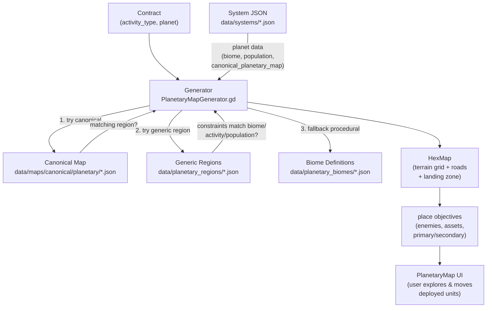
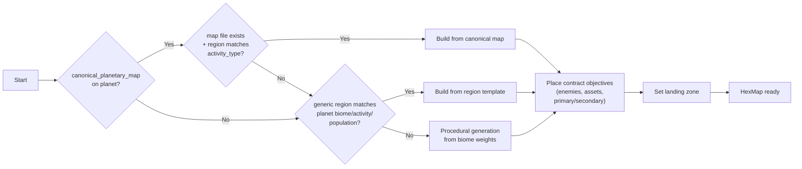
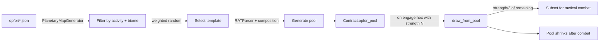

# Planetary Map Generation

This document describes the data-driven planetary hex map generation system used for the operational layer. The system supports three tiers of map generation — canonical maps, generic region templates, and procedural generation — all driven by JSON data files with no code changes required.

## Architecture



## Data Files

### 1. Biome Definitions — `data/planetary_biomes/*.json`

Defines terrain weight tables, condition rules for deriving a biome from planet data, and map sizes per contract activity type. All files in the directory are merged at load time — later files override earlier ones for the same keys.

**`default.json`** ships with the game. Developers add additional `.json` files to add new biomes or override existing ones.

```
data/planetary_biomes/
└── default.json
```

**Structure:**

```json
{
  "biomes": {
    "biome_name": {
      "TERRAIN_NAME": weight_percent,
      ...
    }
  },
  "conditions": [
    { "activity": "Riot", "biome": "urban" },
    { "atmo_in": ["none", "trace"], "biome": "desert" },
    { "temp_min": 50, "biome": "desert" },
    { "temp_max": -20, "biome": "tundra" },
    { "land_max": 20, "biome": "oceanic" }
  ],
  "map_sizes": {
    "Garrison": [12, 10],
    "Riot": [8, 8]
  }
}
```

**Condition evaluation order** (first match wins):

1. Per-planet `biome` field in system JSON (always wins)
2. Activity type match (e.g., Riot → urban)
3. Atmosphere type match (`atmo_in`)
4. Minimum temperature (`temp_min`)
5. Maximum temperature (`temp_max`)
6. Maximum land percentage (`land_max`)
7. Fallback: `"temperate"`

**Valid terrain names:** `PLAINS`, `FOREST`, `MOUNTAIN`, `WATER`, `URBAN`, `DESERT`, `ROUGH`

**Roads and rivers:**

Both use the path format `"q1,r1-q2,r2-q3,r3"` — hyphen-separated hex coordinates. All hexes on the path get the corresponding flag.

| Feature | Effect on movement |
|---------|-------------------|
| Road | Reduces cost to 1 day regardless of terrain |
| River | Adds +0.5 days unless a road (bridge) also shares the hex |
| Road + river in same hex | Bridge — road cost (1 day), no river penalty |

### 2. Generic Region Templates — `data/planetary_regions/*.json`

Pre-authored terrain grids with road networks that can generate on any planet matching their constraint rules. Selected by weighted random from the candidate pool. All files in the directory are merged.

```
data/planetary_regions/
└── default.json
```

**Structure:**

```json
{
  "regions": [
    {
      "name": "Mountain Pass",
      "width": 10,
      "height": 8,
      "terrain": [
        "PLAINS ROUGH MOUNTAIN MOUNTAIN MOUNTAIN ...",
        "PLAINS PLAINS ROUGH MOUNTAIN MOUNTAIN ...",
        "..."
      ],
      "roads": [
        "4,2-5,2",
        "3,3-3,4"
      ],
      "constraints": {
        "biomes": ["temperate", "tundra"],
        "activity_types": ["Assault", "Defense", "Recon"],
        "population_min": 0,
        "population_max": null
      },
      "weight": 30
    }
  ]
}
```

**Fields:**

| Field | Type | Description |
|-------|------|-------------|
| `name` | string | Human-readable label |
| `width`, `height` | int | Grid dimensions (must fit within contract map bounds or region is skipped) |
| `terrain` | array of string | One string per row, space-separated terrain names |
| `roads` | array of string | Optional. `q,r-q,r` paths connecting hexes with roads. Roads reduce travel cost to 1 day. |
| `rivers` | array of string | Optional. `q,r-q,r` paths of hexes a river flows through. Adds +0.5 days travel cost unless a road (bridge) is also present. |
| `constraints.biomes` | array of string | Biome names this region can appear in. Empty = any biome |
| `constraints.activity_types` | array of string | Contract activity types this region fits. Empty = any type |
| `constraints.population_min` | int | Minimum planet population. -1 or omitted = no minimum |
| `constraints.population_max` | int | Maximum planet population. -1 or omitted = no maximum |
| `weight` | int | Relative selection weight (higher = more likely when multiple regions match) |

### 3. Canonical Maps — `data/maps/canonical/planetary/*.json`

Fully pre-authored maps for specific planets and regions. Referenced from the system JSON file via the `canonical_planetary_map` field on the planet entry. Always used when present and a matching region exists.

```
data/maps/canonical/planetary/
└── galatea_canopy_village.json
```

**Structure:**

```json
{
  "name": "Canopy Village — Galatea",
  "width": 12,
  "height": 10,
  "terrain": [
    "PLAINS PLAINS PLAINS ...",
    "..."
  ],
  "roads": [
    "5,3-6,3-6,4"
  ],
  "regions": [
    {
      "name": "urban_center",
      "description": "Central village and surrounding forest",
      "q_min": 4, "q_max": 9, "r_min": 3, "r_max": 6,
      "activity_types": ["Garrison", "Riot", "Defense"],
      "default_landing_zone": [6, 4]
    }
  ]
}
```

**Fields:**

| Field | Type | Description |
|-------|------|-------------|
| `name` | string | Human-readable label |
| `width`, `height` | int | Grid dimensions |
| `terrain` | array of string | One string per row, space-separated terrain names |
| `roads` | array of string | Optional. `q,r-q,r` hex road paths. Reduces travel cost to 1 day. |
| `rivers` | array of string | Optional. `q,r-q,r` hex river paths. Adds +0.5 days travel cost unless a road (bridge) is also present in the hex. |
| `regions` | array | Named sub-regions within the map |
| region: `name` | string | Region identifier |
| region: `q_min`, `q_max`, `r_min`, `r_max` | int | Axial coordinate bounds |
| region: `activity_types` | array of string | Which contract types this region supports |
| region: `default_landing_zone` | array [q, r] | Optional. Preferred LZ within the region |

**Referencing from system JSON:**

Add to the planet entry in `data/systems/<planet>.json`:

```json
{
  "name": "Galatea III",
  "canonical_planetary_map": "galatea_canopy_village",
  "population": 1000000,
  ...
}
```

### 4. Per-Planet Biome Override

Planets in `data/systems/*.json` can specify a direct biome override, bypassing all condition rules:

```json
{
  "name": "Hesperus II",
  "biome": "mountain_fortress",
  ...
}
```

The biome name must exist in `data/planetary_biomes/*.json`. If it doesn't, the generator falls through to normal condition evaluation and returns `"temperate"`.

## Generator Resolution Order



All paths converge at objective placement and landing zone assignment, ensuring contracts always get appropriate mission targets regardless of which generation path produced the terrain.

## OpFor Pool Generation

Opposing force templates are loaded from `data/planetary/opfor/*.json` and selected per-contract. The pool is cached on the contract and persists across engagements.



## Data-Driven Objectives

Objective templates and exploration events are loaded from `data/planetary_objectives/*.json`. All files in the directory are merged — developers add new objectives or events by dropping in additional `.json` files without touching defaults.

### Objective Templates — `data/planetary_objectives/*.json`

Each template defines an objective type, placement rules, and conditions:

```json
{
  "objectives": [
    {
      "id": "rescue_hostages",
      "type": "SECONDARY",
      "label": "Rescue Hostages",
      "count": {"min": 1, "max": 1},
      "priority": 6,
      "activity_types": ["Riot", "Assault"],
      "biomes": ["urban"],
      "data": {"type": "rescue", "discovery_text": "Civilians are being held here."},
      "weight": 30
    }
  ]
}
```

| Field | Type | Description |
|-------|------|-------------|
| `id` | string | Unique identifier |
| `type` | string | `PRIMARY`, `SECONDARY`, `ASSETS`, or `ENEMY` |
| `label` | string | Display name (for future UI) |
| `count.min` | int | Minimum number to place. 0 = may skip |
| `count.max` | int | Maximum number to place |
| `priority` | int | Higher = placed first (primaries first, then secondaries, etc.) |
| `activity_types` | array of string | Contract activity types that can use this. `["*"]` = all |
| `biomes` | array of string | Biomes this can appear in. `["*"]` = all |
| `data` | object | Placed as `objective_data` on the hex |
| `weight` | int | Relative selection weight within the same priority tier |

**Data dynamic fields:**

| Data field | Effect |
|------------|--------|
| `copies_activity: true` | Replaces `data.type` with the contract's activity type |
| `value_range: [min, max]` | Replaced at placement time with `randi_range(min, max)` → `data.value` |
| `strength_range: [min, max]` | Replaced at placement time with `randi_range(min, max)` → `data.strength` |

**Placement flow:**

1. Filter templates by `activity_types` and `biomes`
2. Sort by `priority` (highest first)
3. For each template, place `randi_range(count.min, count.max)` instances on shuffled candidate hexes
4. Fallback: if no templates match, no objectives are placed (map is still playable as a free-exploration zone)

### Exploration Events

Events trigger dynamically when the player explores a hex:

```json
{
  "events": [
    {
      "id": "lostech_discovery",
      "trigger": "on_explore",
      "conditions": {
        "hex_not_objective": true,
        "hex_biomes": ["desert", "mountain", "rough"],
        "chance": 0.05,
        "min_explored": 5
      },
      "effect": {
        "message": "Your scouts discover the remnants of an old Star League outpost!",
        "actions": [
          {"type": "add_objective", "objective_type": "ASSETS", "data": {"type": "lostech_cache", "description": "Star League-era equipment cache.", "value": 75000}}
        ]
      }
    }
  ]
}
```

| Condition | Type | Description |
|-----------|------|-------------|
| `hex_not_objective` | bool | Only trigger on hexes that have no pre-placed objective |
| `hex_biomes` | array | Only trigger if the hex's terrain-biome matches (currently unused; for future terrain-type matching) |
| `chance` | float | 0–1 probability of triggering |
| `min_explored` | int | Minimum number of hexes already explored |

**Effects:**

| Action type | Effect |
|-------------|--------|
| `add_objective` | Places a new objective on the explored hex with the given `objective_type` and `data` |
| (future) spawn_enemy | Triggers an immediate tactical engagement |
| (future) reveal | Reveals a group of nearby hexes |

**Fallback:** If no event triggers, the hex shows the standard "Nothing of interest" result.

### Relationship to the Event System

When the full event system (Phase 2 / Timeline System Data) is implemented, exploration events will be superseded by the generic event pipeline — `DiffPacket` queue, display modes, branching choices. The `data/planetary_objectives/*.json` format is designed to map onto those structures: an exploration event's `effect.actions` become the `DiffPacket` payload, and the `message` becomes the event display text.

## Mission Progress

Each hex with an objective has an `objective_completed` flag tracked in the serialized map state:

| Objective type | Completed when |
|----------------|----------------|
| PRIMARY | Tactical engagement launched via "Engage Enemy" |
| SECONDARY | Hex explored (revealed) |
| ASSETS | Asset dialog accept or decline ("Take Assets" / "Leave Them") |
| ENEMY | Tactical engagement launched via "Engage Enemy" |

The sidebar shows a progress line with icons: `★ 0/1  ● 1/2  ⚙ 2/4  ⚔ 0/3`.

**Contract completion** is gated by primary objectives. Closing the planetary map with incomplete primaries shows a confirmation dialog: *"Primary objectives remain incomplete. The contract will not be fulfilled. Return anyway?"* If the player proceeds, the map closes but the contract remains active (they can return later). If all primaries are complete, the close button returns to starmap immediately.

**Note:** Settlement (salvage processing, reputation changes, final payment) is not yet linked to the completion flow — that will be wired when the tactical layer is fully operational and produces engagement results.

## Testing

Tests live in `tests/test_planetary_map_generator.gd` and cover:

| Test | What it verifies |
|------|------------------|
| `_test_generates_valid_map` | Generator returns a non-null HexMap |
| `_test_map_size_by_activity` | Each activity type produces correct map dimensions |
| `_test_objectives_placed` | At least 1 primary, 1 secondary, 1 asset, 1 enemy per map |
| `_test_landing_zone_valid` | Landing zone hex exists on the map |
| `_test_no_water_landing_zone` | Landing zone never placed on WATER |
| `_test_riot_terrain` | Riot contracts produce ≥40% URBAN hexes |
| `_test_planet_biome_override` | Planet `biome` field overrides activity-type biome |
